**Prometheus监控方案**

```
Prometheus是一套开源的系统监控报警框架。它启发于 Google 的 borgmon 监控系统，被称为运维界的”火种”基于时间序列的数值数据的容器的监控解决方案，适合监控容器，扩展性强可做集群和读写分离

最初是在SoundCloud建立的。自2012年成立以来，许多公司和组织都采用了普罗米修斯，该项目拥有一个非常活跃的开发者和用户社区。它现在是一个独立的开放源码项目，并且独立于任何公司。为了强调这一点，为了澄清项目的治理结构，普罗米修斯在2016年加入了云计算基金会，成为继Kubernetes之后的第二个托管项目。

特征：
多维度数据模型
灵活的查询语言
不依赖分布式存储，单个服务器节点是自主的
以HTTP方式，通过pull模型拉去时间序列数据
也通过中间网关支持push模型
通过服务发现或者静态配置，来发现目标服务对象
支持多种多样的图表和界面展示，grafana也支持它
高效：平均每个采样点仅占 3.5 bytes，且一个 Prometheus server 可以处理数百万的 metrics。

Prometheus组件
  Prometheus负责收集数据，Grafana负责展示数据。其中采用Prometheus 中的 Exporter含：
 ① Node Exporter，负责收集 host 硬件和操作系统数据。它将以容器方式运行在所有 host 上。
 ② cadvisor，负责收集容器数据。它将以容器方式运行在所有 host 上。
 ③ Alertmanager，负责告警。它将以容器方式运行在所有 host 上。
```

架构


`下面这张图说明了Prometheus的整体架构，以及生态中的一些组件作用:` 

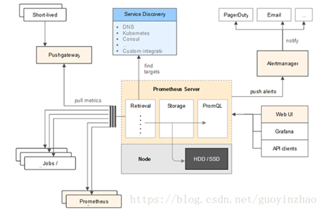

```` 

计划监控标准
1. 统一监控内容：将基础监控进行统一，默认每个机器都包含CPU，内存，磁盘空间等基础信息监控；

2. 覆盖式监控：将所有机器均纳入监控，除去基础监控以外，最重要的当属业务监控，尽可能的覆盖业务流程，通过自定义监控减少和去除重复的问题，保障业务稳定运行。

3. 及时通知，确保无漏报：将所有监控分类，根据重要程度、紧急程度等，分别用邮件，微信，短信，电话等不同级别的方式通知，确保每个监控都有人处理。

````

# 部署流程

## **docker安装prometheus+grafana**

### 1. 修改时区 

```
调整时区     
先查看当前系统时间  

root@ubuntu:/#  date -R     

 1.运行tzselect  
 root@ubuntu:/#  tzselect  
 在这里我们选择亚洲 Asia，确认之后选择中国（China)，最后选择北京(Beijing)     

 2.复制文件到/etc目录下  
 root@ubuntu:/#  cp /usr/share/zoneinfo/Asia/Shanghai /etc/localtime     

 3.再次查看时间date -R，已经修改为北京时间
```

### 2.时间同步

```` 
安装chrony：  
apt -y  install chrony ntpdate     

修改配置：  nano /etc/chrony.conf     
# Use  public servers from the pool.ntp.org project.  
#  Please consider joining the pool (http://www.pool.ntp.org/join.html).  
#server  0.centos.pool.ntp.org iburst  
#server  1.centos.pool.ntp.org iburst  
#server  2.centos.pool.ntp.org iburst  
#server  3.centos.pool.ntp.org iburst  
server  ntp1.aliyun.com iburst minpoll 4 maxpoll 10  
server  ntp2.aliyun.com iburst minpoll 4 maxpoll 10  
server  ntp3.aliyun.com iburst minpoll 4 maxpoll 10  
server  ntp4.aliyun.com iburst minpoll 4 maxpoll 10  
server  ntp5.aliyun.com iburst minpoll 4 maxpoll 10 
server  ntp6.aliyun.com iburst minpoll 4 maxpoll 10  
server  ntp7.aliyun.com iburst minpoll 4 maxpoll 10  
#  Record the rate at which the system clock gains/losses time.  
driftfile  /var/lib/chrony/drift  
# Allow  the system clock to be stepped in the first three updates  
# if  its offset is larger than 1 second.  
makestep  1.0 3  
#  Enable kernel synchronization of the real-time clock (RTC).  
rtcsync  
# Enable hardware timestamping on all interfaces that support it.  
#hwtimestamp
# Increase  the minimum number of selectable sources required to adjust  
# the  system clock. 
#minsources  2  
# Allow  NTP client access from local network.  allow  192.168.0.0/24  
# Serve  time even if not synchronized to a time source.  
#local  stratum 10  
#  Specify file containing keys for NTP authentication.  
#keyfile  /etc/chrony.keys  
#  Specify directory for log files.  logdir  /var/log/chrony  
#  Select which information is logged.  
#log  measurements statistics tracking
````

### 3、安装docker

```
1. 卸载旧版本：  sudo apt remove docker docker-engine  docker.io containerd runc

2. 更新apt包：  sudo apt update

3. 安装 repository  
sudo apt install apt-transport-https ca-certificates curl gnupg-agent   software-properties-common   

4.添加Docker官方的GPG密钥
sudo curl -fsSL http://mirrors.aliyun.com/docker-ce/linux/ubuntu/gpg | sudo apt-key add - 

5. 安装稳定存储库  sudo add-apt-repository \
"deb [arch=amd64]  http://mirrors.aliyun.com/docker-ce/linux/ubuntu \
 $(lsb_release -cs) \ 
 stable"    

6. 更新并安装
dockers  sudo apt update  sudo apt install docker-ce  docker-ce-cli containerd.io

7. 查看dockers 信息  
sudo docker info    

8. 为了永久性保留更改，您可以修改  /etc/docker/daemon.json 文件并添加上 registry-mirrors 键值     

cat << EOF >>  /etc/docker/daemon.json  
{    
"registry-mirrors":  ["http://hub-mirror.c.163.com"]  
}  
EOF     

9. 重启docker  

systemctl daemon-reload &&  systemctl restart docker
```

### 4.服务器端安装

```

1. 启动prometheus  
mkdir /opt/prometheus && cd  /opt/prometheus     

cat <<EOF> prometheus.yml
global:
  scrape_interval:     60s
  evaluation_interval: 60s
scrape_configs:
  - job_name: prometheus
    static_configs:
      - targets: ['192.168.0.35:9090']
        labels:
          instance: prometheus
  - job_name: linux
    static_configs:
      - targets: ['192.168.0.35:9100']
        labels:
          instance: localhost
EOF


docker run -d \      
   -p 9090:9090 \  
   --restart=always \
   --name=prometheus \      
   -v /opt/prometheus/:/etc/prometheus/ \      
   prom/prometheus     

测试  curl  http://192.168.0.35:9090/graph     

2.启动grafana 

mkdir /opt/grafana-storage &&  chmod 777 -R /opt/grafana-storage
docker run -d \    
   -p 3000:3000 \
   --restart=always \
   --name=grafana \    
   -v  /opt/grafana-storage:/var/lib/grafana \    
   grafana/grafana     

 测试  curl http://192.168.0.35:3000    

3. 启动node-exporter  

   docker run -d -p 9100:9100 \   
   --name=node-exporter \  
   --restart=always \
   -v "/proc:/host/proc:ro" \   
   -v  "/sys:/host/sys:ro" \  
   -v "/:/rootfs:ro" \    
   --network=host \   
   prom/node-exporter

4. 测试  curl http://192.168.0.35:9100/metrics
```

### 5、客户端安装配置                           

```
1.启动node-exporter  

docker run -d -p 9100:9100 \   
--name=node-exporter \ 
--restart=always \
-v  "/proc:/host/proc:ro"\   
-v  "/sys:/host/sys:ro" \   
-v "/:/rootfs:ro" \      
--network=host \   
prom/node-exporter     

测试  curl http://192.168.0.35:9100/metrics     

2. 修改服务器端配置  
cat  <<EOF>> prometheus.yml   
 -- job_name: node-01    
    static_configs:     
    - targets:  ['192.168.0.23:9100']      
      labels:       
        instance: zabbix-agent  
EOF
```


    - targets:  ['192.168.0.23:9100']      
      labels:       
        instance: zabbix-agent  
EOF

### 6、浏览器登录

```
 http://192.168.0.35:3000     

 默认账号密码：admin / admin  
 Admin / 123123
```

### 7、常用模板 - https://grafana.com/grafana/dashboards

```
https://grafana.com/grafana/dashboards     

https://grafana.com/grafana/dashboards/8919    

https://grafana.com/grafana/dashboards/11074   

https://grafana.com/grafana/dashboards/12227   

https://grafana.com/grafana/dashboards/12377
```

### 8、注意事项

```
##在客户端运行node_export之后，在/opt/Prometheus/Prometheus.yml中些一下给格式的配置

 - job_name: node-01 ##节点名称 可看做一个组
   static_configs: ##静态配置

    - targets: ['192.168.0.23:9100'] ##配置被监控的主机+端口
      labels:  ##标签可省略
        instance: zabbix-agent ##选择数据源，被监控主机不写 

- job_name: node-01 

  static_configs: 

       -targets: ['192.168.0.23:9100'] 

  ##一般只需配置这三行即可
```

## 设置Granfana图形化表示流程

`登陆http://localhost:9090,即可看到监控的主机`

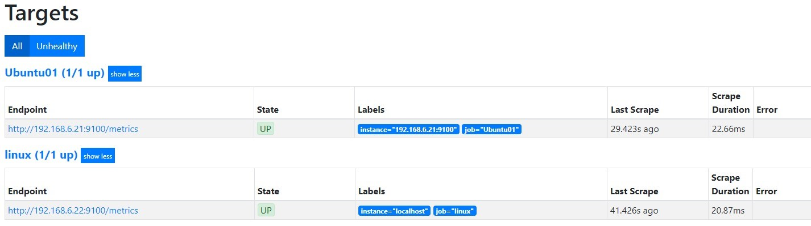

`访问http://localhost:3000即可登陆Grafana`

`如下图点击Config`

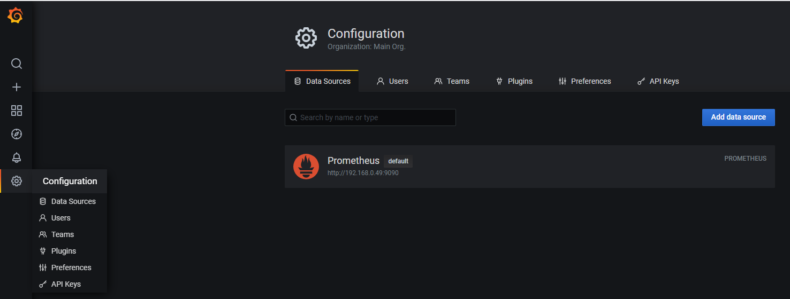

`点击Add data source 选择数据源`

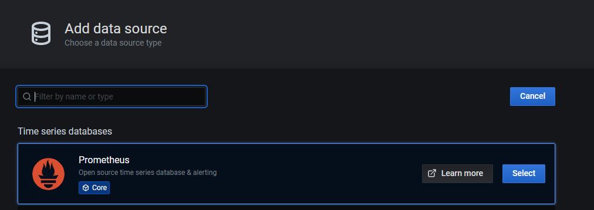

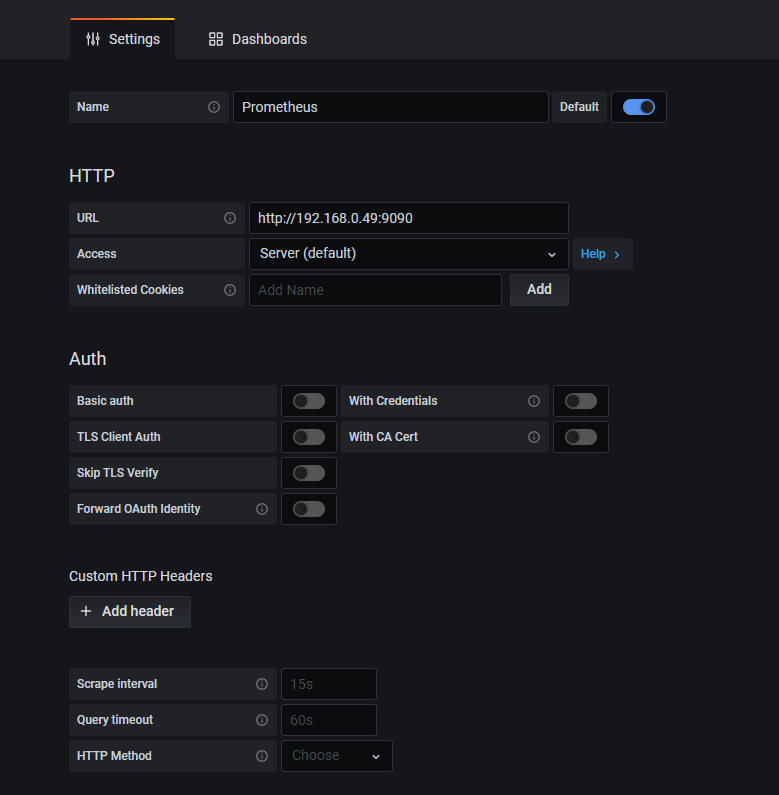

```` 

填写 名称 URL 这里选择http请求方式为GET

添加数据源格式为 http://本机地址:9090
点击 Save & Test 即可测试保存

````

#### 添加模块

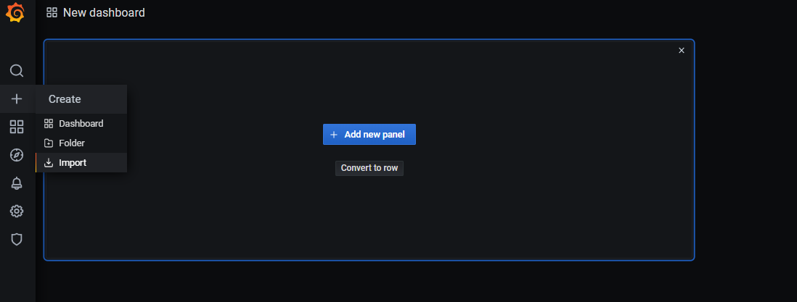

```` 
点击import后点击Add new panel添加模板
在Import via grafana.com下面输出ID点击Load即可添加模块（本案例ID为8919）
## ID号举例 8919 11074 12227 12377 在可以连接互联网才可以
````

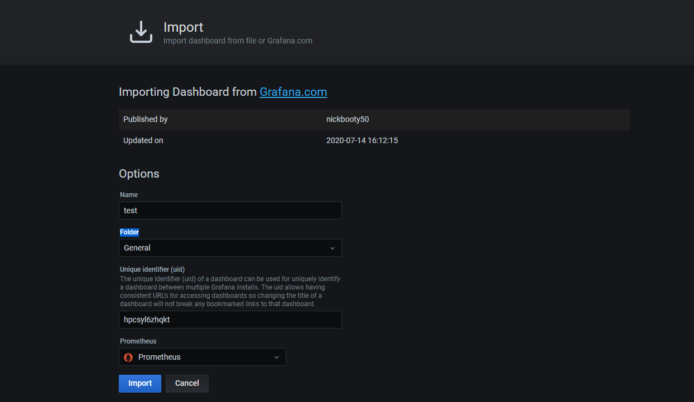

`选择`

`名称、唯一标识符（uid）、默认放在Genearl的夹子里 选择数据源 Prometheus`

`最后点击 Import（导入）`

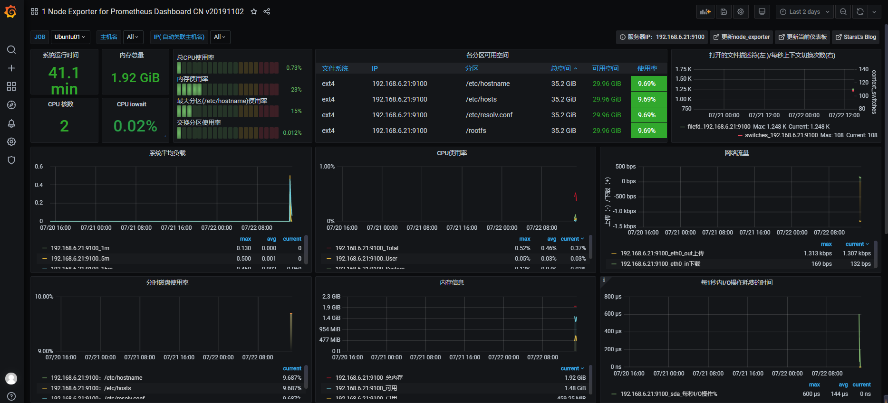

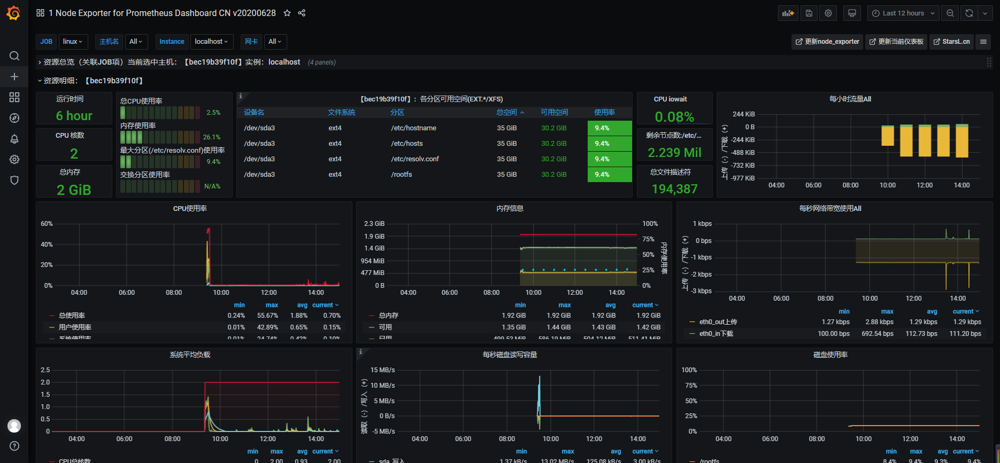


## Prometheus GPU监控

注:本实验是通过显卡驱动来获取显卡信息最后编辑Metrics的值,通过Grafana来显示出GPU的信息

### 1.安装 datacenter-gpu-manager_1.7.2_amd64.deb

```
拉取datacenter-gpu-manager_1.7.2_amd64.deb的软件包到本地

root@HBD907:~# dpkg -i datacenter-gpu-manager_1.7.2_amd64.deb

root@HBD907:~# nvidia-smi -L  ##查看当前显卡驱动
```

```
##如果没有驱动则下载驱动root@HBD907:~# apt install -y ubuntu-drivers-common ubuntu-drivers devices#获取推荐显卡驱动

root@HBD907:~# apt-get install -y nvidia-driver-440 --fix-missing ##安装驱动

root@HBD907:~# nvidia-smi -L  ##再次查看当前显卡驱动

GPU 0: GeForce RTX 2080 Ti (UUID: GPU-518560ea-0b35-5dec-0ffa-5d77816dcc82)

##看到GPU型号即可成功
```

### 2.为gpu-monitoring-tools安装依赖软件 golang

```
cat <<EOF>>~/.bashrc

export GOPROXY=https://goproxy.io

EOF

root@HBD907:~# source .bashrc

root@HBD907:~# add-apt-repository ppa:longsleep/golang-backports

root@HBD907:~# apt update

root@HBD907:~# apt install -y golang-go
```

### 3.安装gpu-monitoring-tools

```
root@HBD907:~# git clone https://github.com/NVIDIA/gpu-monitoring-tools.git

root@HBD907:~# cd gpu-monitoring-tools

root@HBD907:~# make binary

###返回信息:
go build -o dcgm-exporter github.com/NVIDIA/gpu-monitoring-tools/pkg

root@HBD907:~# make install

###返回信息:
go build -o dcgm-exporter github.com/NVIDIA/gpu-monitoring-tools/pkg
install -m 557 dcgm-exporter /usr/bin/dcgm-exporter
install -m 557 -D ./etc/dcgm-exporter/default-counters.csv /etc/dcgm-exporter/default-counters.csv
install -m 557 -D ./etc/dcgm-exporter/dcp-metrics-included.csv /etc/dcgm-exporter/dcp-metrics-included.csv
```


### **4.运行dcgm-exporter**

```` 

root@HBD907:~# which dcgm-exporter

/usr/bin/dcgm-exporter ##查看dcgm-exporter命令路径

##进入gpu-monitoring-tools目录

root@HBD907:~/gpu-monitoring-tools# dcgm-expor

返回值如下:

INFO[0000] Starting dcgm-exporter

INFO[0000] DCGM successfully initialized!

INFO[0000] Pipeline starting

INFO[0000] Starting webserver

测试，可以看到监控的数据

root@HBD907:~# curl 192.168.6.21:9400/metrics

##ip地址为“客户端”dcgm-exporter的地址

````

### 5.设置dcgm-exporter开机启动

```
cat <<EOF>> /lib/systemd/system/dcgm-exporter.service

[Unit]
Description=dcgm-exporter service

[Service]
User=root
ExecStart=/usr/bin/dcgm-exporter
TimeoutStopSec=10
Restart=on-failure
RestartSec=5
[Install]
WantedBy=multi-user.target

EOF

systemctl daemon-reload

systemctl enable dcgm-exporter.service

systemctl start dcgm-exporter.service

systemctl status dcgm-exporter.service
```


### **6. 修改Prometheus 配置**

```` 
在添加配置/opt/prometheus/prometheus.yml ##注意格式

- job_name: 'gpu'   ##定义一个GPU的组
    static_configs:
    - targets:
      -“192.168.6.21:9400”

重启prometheus

systemctl restart 容器ID
````

#### 使用12027模板

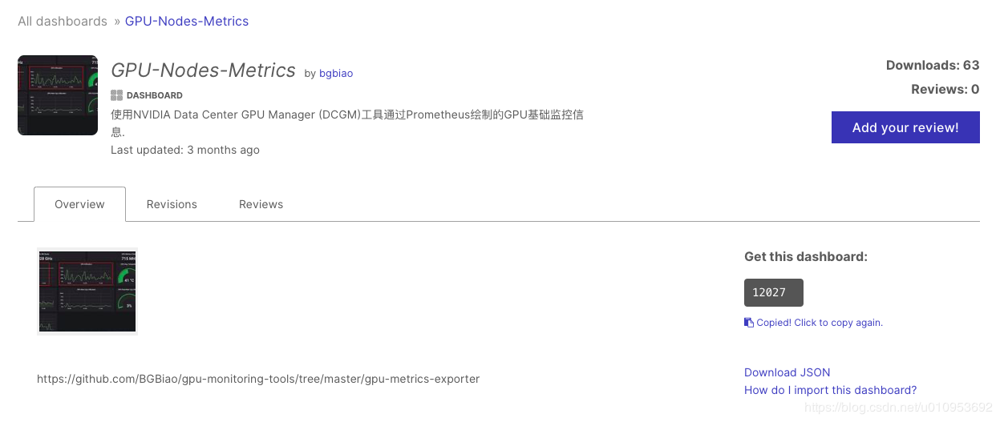

#### 手动设置监控

`导入ID为12027的模板默认无法识别节点`


`因为我们的job_name为gpu所以要与主机名的语法对应`

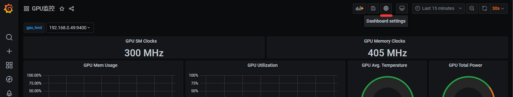

`点击设置`

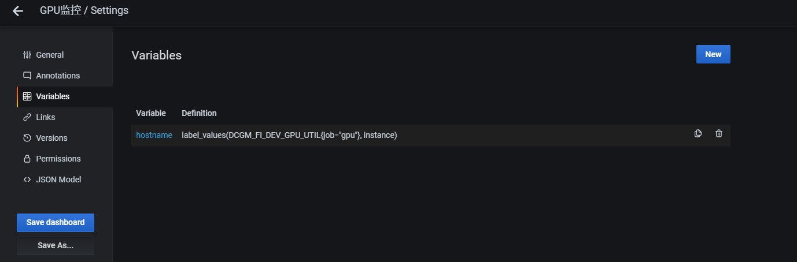

`点击hostname字段`


`因为我们的job_name为gpu所以这里要对应否则无法显示节点`

`点击保存，应用。`

`手动插入指标`

`比如说为GPU使用率插入值 则点击Edit`

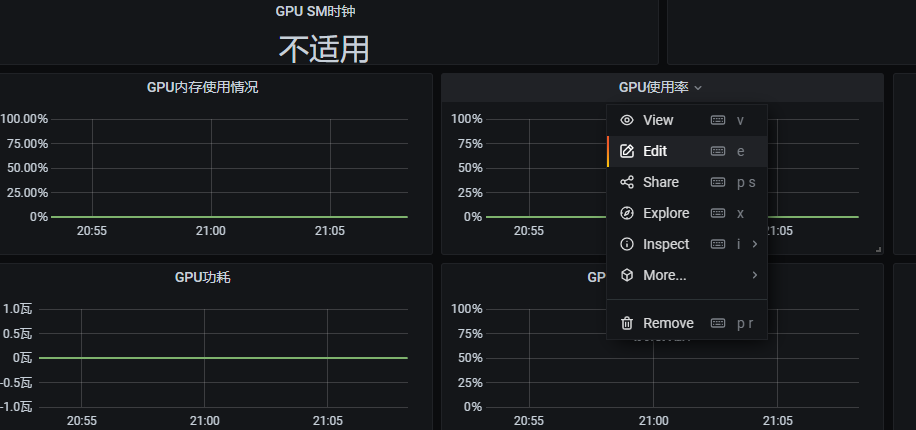

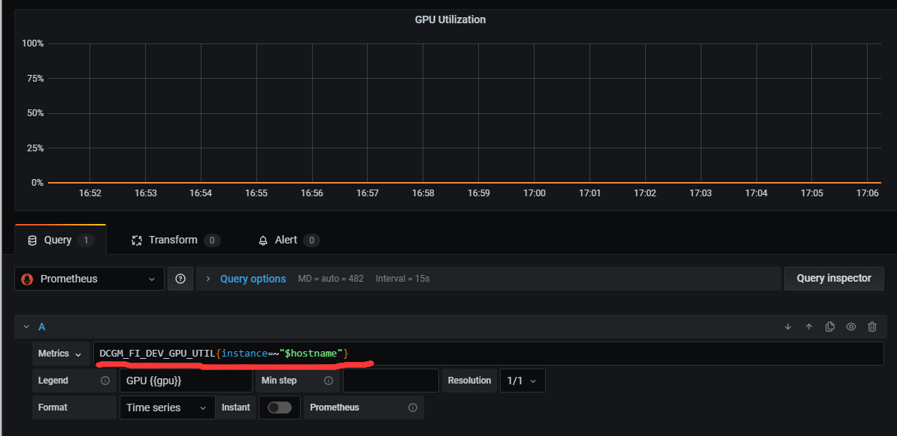

`将内容插入到Metrics这一行`

`查看抓取的数据`

`curl http://127.0.0.1:9400/metrics`


#### 指标如下

```
DCGM_FI_DEV_GPU_UTIL{instance=~"$hostname"}        ##GPU使用率

DCGM_FI_DEV_FB_USED{instance=~"$hostname"}         ## GPU 已用内存

DCGM_FI_DEV_FB_USED{instance=~"$hostname"}+DCGM_FI_DEV_FB_FREE{instance=~"$hostname"}   
# GPU 总内存`

DCGM_FI_DEV_GPU_TEMP{instance=~"$hostname"}        ## GPU运行温度


平均值

GPU温度平均值 GPU Avg. Temperature

avg(DCGM_FI_DEV_GPU_TEMP{instance=~"$hostname"})

GPU 功率 GPU Total Power

sum(DCGM_FI_DEV_POWER_USAGE{instance=~"$hostname"})

GPU 内存使用率 GPU Total Mem Cpy Utilization

avg(DCGM_FI_DEV_MEM_COPY_UTIL{instance=~"$hostname"})

GPU 使用率 GPU Total Utilization

avg(DCGM_FI_DEV_GPU_UTIL{instance=~"$hostname"})

详细可看连接  https://blog.csdn.net/u010953692/article/details/107143338
```


```
项目实际部署

头机：已部署Promrtheus

ip.txt ##监控主机IP地址

prometheus.sh 自动写Prometheus的配置文件

## node_export.sh docker节点自动部署node_exporter监控

## dcgm_dcgm_exporter.sh 节点自动部署 dcgm_exporter.sh

头机执行 prometheus.sh

被监控主机执行
node_exporter.sh和dcgm_exporter.sh
```

## Prometheus实现钉钉告警

```
  在 prometheus 中定义你的监控规则，即配置一个触发器，某个值超过了设置的阈值就触发告警， prometheus 会推送当前的告警规则到 alertmanager，alertmanager 收到了会进行一系列的流程处理，然后发送到接收人手里。
Alertmanager 主要用于接收 Prometheus 发送的告警信息，它支持丰富的告警通知渠道，例如邮件、微信、钉钉、Slack 等常用沟通工具，而且很容易做到告警信息进行去重，降噪，分组等，是一款很好用的告警通知系统。本案例是Prometheus通过webhook推送告警至钉钉

注:本项目基于安装Docker+Prometheus+Grafana和node_exporter的基础上

项目架构

192.168.6.1 Docker+Prometheus+Grafana+node_exporter

192.168.6.2 Docker+node_exporter

踩坑点

1. yaml语法较为严格切记要严谨所以添加内容尽量用 cat <<EOF>> 文件名 内容 EOF的方式写入

2. 在 cat <<EOF>> 文件名 内容 EOF 这的方式写入时 “summary: "{{$labels.instance}}”这样的配置会把 $labels给漏掉需要检查配置文件  {{$value }} 遇到这样的双括号的配置要注意检查!!!
```

### **创建钉钉机器人获得token**

#### **1.1 webhook**

打开钉钉群点击群设置

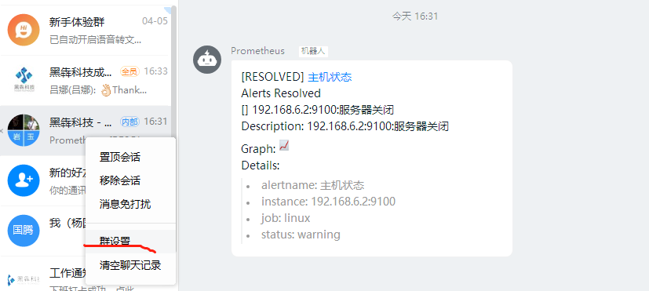

\##然后点击智能群助手

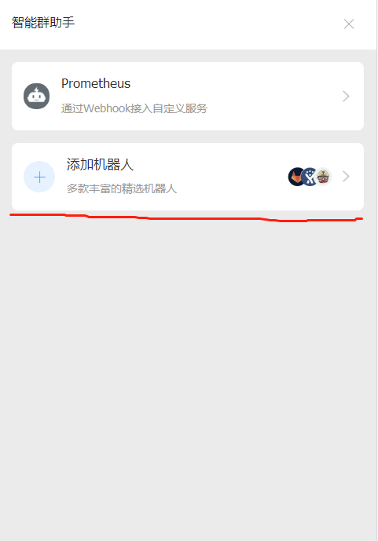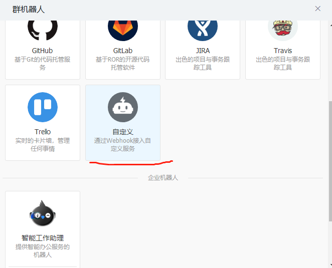


\##点击添加机器人,添加自定义机器人


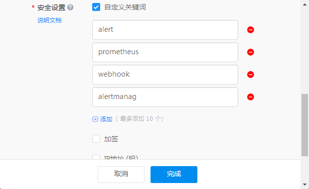

\##上面的划线的Webhook 里面有钉钉的token

\##这里我们选择“自定义关键词”

https://oapi.dingtalk.com/robot/send?access_token=771dbdc604e83dc044c4411521ec1d3b8760958cb6fd464f762e1170dfdaa32e

#### **1.2 docker部署(192.168.6.1操作)**

```
docker pull timonwong/prometheus-webhook-dingtalk

# 启动容器

docker run -d \

-p 8060:8060 \

--name webhook timonwong/prometheus-webhook --ding.profile=https://oapi.dingtalk.com/robot/send?access_token=771dbdc604e83dc044c4411521ec1d3b8760958cb6fd464f762e1170dfdaa32e

##上面是我的token切莫盲目重复
```

### **2. 配置alertmanager**

####  2.1 docker安装alertmanger

```
docker run -d \

--name alertmanager \

-p 9093:9093 \

-v /opt/alertmanager/:/etc/alertmanager/ \

prom/alertmanager:latest
```

 

#### 2.2 alertmanager配置文件

```
alertmanager.yml

global:

 resolve_timeout: 5

route:

 receiver: webhook

 group_wait: 30s

 group_interval: 1m

 repeat_interval: 1m

 group_by: [alertname]

 routes:

  - receiver: webhook

  group_wait: 10s

receivers:

 - name: webhook

 webhook_configs:

  - url: http://192.168.6.1:8060/dingtalk/webhook1/send

  send_resolved: true
```


### **3. prometheus配置告警文件文件**

#### 3.1 修改prometheus-config.yml

 

```
alerting:

 alertmanagers:

 - static_configs:

 - targets: ["192.168.6.1:9093"] 

rule_files:

 - "/opt/prometheus/rules.yml"
```

 

#### **3.2 **配置rules.yml文件**

```
cat <<EOF>> rules.yml

groups:

  - name: test-rule

   rules:

   - alert: 主机状态

    expr: up == 0

    for: 5s

    labels:

     status: warning

    annotations:

     summary: "{{$labels.instance}}:服务器关闭"

     description: "{{$labels.instance}}:服务器关闭"

EOF
```

\##配置完rules.yaml文件重启prometheus就可以看到告警规则

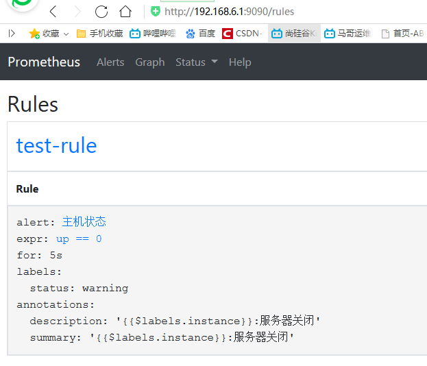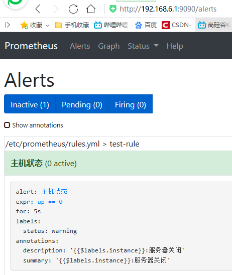

\##此时停止node_export或关机就会收到报警


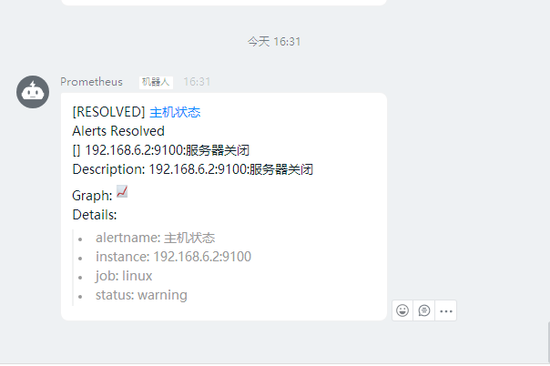