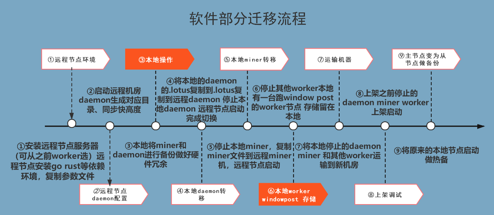

## **服务转移方案**

当业务不断发展需要考虑当硬件转移（如更换机房，客户放在自己的机房）等情况考虑服务器搬迁，涉及的应用服务器均停用，在有限的时间内进行设备的物理位置的移动，确保业务系统在规定时间内均正常的恢复运行以达到保证服务的高可用性，避免出现掉算力以及遇到惩罚机制所以预防这种情况的方案尤为重要，因此对公司的业务系统的转移恢复等要求考虑，制定以下方案。

#### **风险评估**

##### **服务器硬件损坏**

在搬迁过程中，很有可能出现服务器的硬件故障，主要是由于搬迁过程中由于野蛮装卸，不小心滑落，矿机

可能会出现硬件损坏，如硬盘故障导致数据丢失，显卡故障服务器其他硬件损坏等情况对应措施在硬件转移中来避免风险，根据上述情况，我们将有一下解决方案

**解决方案**

1、专业的包装，可以避免在传输过程中的颠簸造成的机器硬件的故障。

2、在搬迁之前进行的服务器的硬件检测可以杜绝机器本身已经存在的问题

3、安排专业的搬运工人实施搬迁工作，防止搬迁过程中的野蛮装卸

4、提供性能相当的服务器作为备用设备运维人员跟进，8小时无法修复的情况，我们将动用备机来恢复系

### **迁移准备**

考虑到日后部分服务器设备运行时间较长平时的业务运转基本上是永不停顿的，为了将设备概率降到最低特定制具体以下步骤：

1、梳理准备工作，提前确定运输时间，

2.搬运前检查需要搬运设备的电源插头，并确定新机房是否配备相关插 座，如果没有，需要做好插座的安装作。 

3、 针对关键业务服务器应充分做好数据的备份工作，系统的备份工作。关掉服务器的电源,切断输入电源。系统直到内部原件充分放电，尽量减少系统搬迁过程中原件损坏可能。  

4、 拆卸前做好电缆，数据线， 标签的工作。 

5、 选择专业的搬家公司，由公司运维将与搬运公司人员一起进行包 装，做到防震、防水，结实牢固。 外包装上贴上设备放置方向的标签。（重要设备不得倒放） 

**问题分析** 考虑window post的24小时的时间窗口，一轮window post结束后24小时之内可恢复所以我们是有时间做迁移的，软件迁移考虑惩罚机制和避免掉算力所以进行热备来让自己的节点在

**软件环境需求：** 

系统：Ubuntu 18.04

热备机器 miner+daemon+sync

热备机器配置：和需要热备的机器统一标准

运输中，能有备用节点跑起来不影响业务。

**软件准备:**

**第一步 搭建远程节点 daemon、miner**

1、 安装依赖环境。复制参数文件

2、启动daemon，生成对应目录 、同步块高度

**第二步 本地操作**

1、将本地daemon的.lotus复制远程daemon ,停止本地daemon, 远程节点启动完成切换

2、停止本地miner，复制miner文件到远程miner机 远程节点启动完成切换

3、停止其他worker 本地留有一台跑window post的worker节点和存储

**第三步 运输**

1、将本地停止的 daemon、miner、worker从本地运输到新机房

**第四步 上架调试**

1、加入worker节点，完成迁移 原主节点启动做热备

**流程图**  

总结：目前还有存储未解决，本地包括一个window post节点和存储

**成本：**

方案一: 需要三台备份机器（miner+daemon+sync）

人工成本：运维工程师、运输员

运输成本：根据服务器数量而定

风险分析:

① 用本地daemon的api替换从节点daemon的api和token 未测试

② Miner不断变化的不止sqllite数据库还包括cache和sealed文件里面保存可抵押扇区的数据 停止转移 未测试